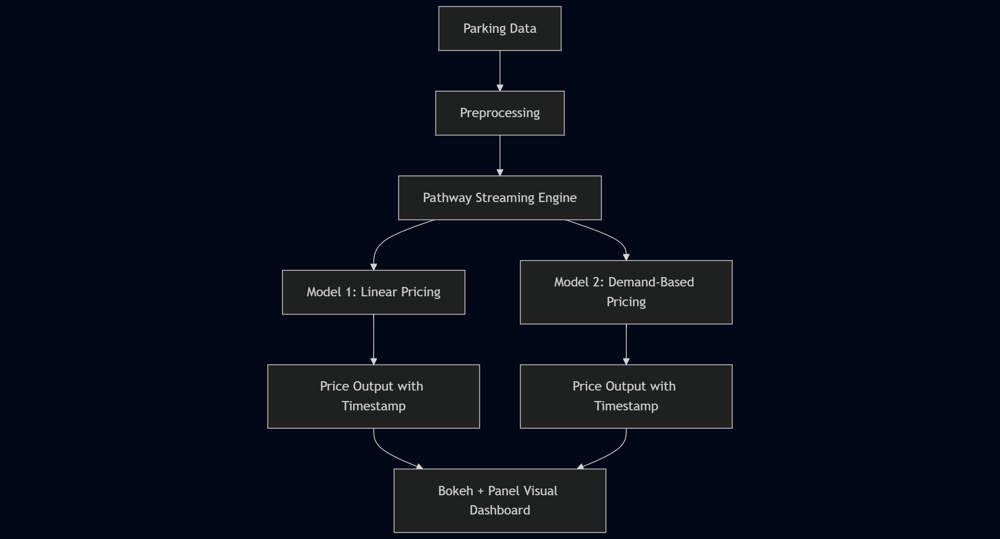

#  Dynamic Parking Pricing System

A real-time data streaming project that dynamically adjusts parking prices based on demand. This project uses **Pathway** to build two pricing models that analyze live occupancy, traffic, and vehicle flow data to generate fair and adaptive pricing strategies.

##  Tech Stack Used

- **Python**: Data manipulation and pipeline logic
- **Pathway**: Real-time data processing and windowing
- **Pandas**: Preprocessing for static data
- **Panel + Bokeh**: Interactive visualizations and dashboards
- **Google Colab**: Development and testing environment
- **Git & GitHub**: Version control and submission

## Architecture Diagram

